# 🚀 Smart Deployment Guide with Testing & Rollbacks

## Overview

This guide covers the new intelligent deployment system with:
- ✅ **Integration testing gates** - deployments fail if tests don't pass
- ✅ **Automatic rollbacks** - failed deployments automatically revert
- ✅ **Multi-environment support** - dev, staging, and production
- ✅ **Manual rollback capabilities** - emergency rollback tools

## 📋 Quick Reference

| Command | Purpose |
|---------|---------|
| `./deploy-with-tests.sh dev` | Deploy to dev with tests |
| `./deploy-with-tests.sh staging` | Deploy to staging with tests |
| `./deploy-with-tests.sh prod` | Deploy to production with tests |
| `./rollback.sh dev` | Rollback dev to previous version |
| `./rollback.sh staging revision-name` | Rollback staging to specific revision |
| `./test-integration.sh <url> <api-key>` | Run tests manually |

## 🎯 Environment Configuration

### Development Environment
- **Project**: `toy-api-dev`
- **Service**: `toy-api-service-dev`
- **Access**: Public (for testing)
- **Resources**: 512Mi memory, 1 CPU
- **Min instances**: 0 (cost optimization)

### Staging Environment  
- **Project**: `toy-api-staging`
- **Service**: `toy-api-service-staging`
- **Access**: Authenticated users only
- **Resources**: 1Gi memory, 1 CPU
- **Min instances**: 0

### Production Environment
- **Project**: `toy-api-prod`
- **Service**: `toy-api-service-prod`  
- **Access**: Authenticated users only
- **Resources**: 2Gi memory, 2 CPU
- **Min instances**: 1 (always warm)

## 🚀 Smart Deployment Process

### How it Works

1. **Pre-deployment**: Captures current revision for rollback
2. **Build & Deploy**: Uses Cloud Build to create container and deploy
3. **Stabilization**: Waits 30 seconds for service to be ready
4. **Integration Tests**: Runs comprehensive test suite
5. **Success**: Deployment completes if all tests pass
6. **Failure**: Automatically rolls back if tests fail

### Deployment Flow

```mermaid
graph TD
    A[Start Deployment] --> B[Capture Current Revision]
    B --> C[Build & Deploy New Version]
    C --> D[Wait for Stabilization]
    D --> E[Run Integration Tests]
    E --> F{Tests Pass?}
    F -->|Yes| G[✅ Deployment Success]
    F -->|No| H[🔄 Automatic Rollback]
    H --> I[⚠️ Rollback Complete]
```



## 🧪 Integration Test Suite

The test suite runs **10 comprehensive tests**:

1. **Health Check** - Root endpoint responds
2. **Public Endpoint** - `/public` is accessible
3. **JSON Response** - Public endpoint returns valid JSON
4. **Auth Rejection** - Private endpoints reject unauthorized requests
5. **API Key Auth** - Authenticated endpoints work with valid API key
6. **Item Creation** - POST requests work with authentication
7. **Token Generation** - Auth token endpoint functions
8. **Invalid Key Rejection** - Invalid API keys are rejected
9. **Response Time** - Service responds within 3 seconds
10. **HTTP Headers** - Proper Content-Type headers returned

### Test Results

- ✅ **All Pass**: Deployment continues
- ❌ **Any Fail**: Automatic rollback triggered

## 📖 Usage Examples

### Deploy to Development
```bash
./deploy-with-tests.sh dev
```

**Expected Output:**
```
🚀 Smart Deployment to dev environment
📸 Capturing current revision for rollback...
🏗️ Building and deploying...
✅ Deployment completed successfully
🧪 Running integration tests...
✅ All integration tests passed
🎉 Deployment to dev completed successfully!
```

### Deploy to Staging (with rollback scenario)
```bash
./deploy-with-tests.sh staging
```

**If tests fail:**
```
🚀 Smart Deployment to staging environment
📸 Capturing current revision for rollback...
🏗️ Building and deploying...
✅ Deployment completed successfully
🧪 Running integration tests...
❌ Integration tests failed
🔄 Initiating automatic rollback...
✅ Rollback completed successfully
⚠️ Deployment rolled back due to test failures
```

### Manual Rollback
```bash
# Rollback to previous version
./rollback.sh prod

# Rollback to specific revision
./rollback.sh prod toy-api-service-prod-00042-qas
```

## 🛠️ Advanced Operations

### View Service Revisions
```bash
gcloud run revisions list \
  --service=toy-api-service-dev \
  --region=us-central1 \
  --project=toy-api-dev
```

### Manual Traffic Splitting
```bash
# Split traffic between two revisions
gcloud run services update-traffic toy-api-service-staging \
  --to-revisions=revision-1=80,revision-2=20 \
  --region=us-central1
```

### View Service Logs
```bash
gcloud run services logs read toy-api-service-dev \
  --region=us-central1 \
  --project=toy-api-dev
```

## 🔧 Troubleshooting

### Deployment Fails Before Tests
**Symptoms**: Build or deploy step fails
**Solutions**:
1. Check Docker build locally: `docker build -t test .`
2. Verify gcloud authentication: `gcloud auth list`
3. Check project permissions
4. Review build logs in Google Cloud Console

### Tests Fail Consistently
**Symptoms**: Tests always fail, automatic rollbacks happening
**Solutions**:
1. Run tests manually: `./test-integration.sh <url> <api-key> dev`
2. Check service logs for runtime errors
3. Verify API key configuration
4. Test individual endpoints with curl

### Rollback Fails
**Symptoms**: Automatic rollback doesn't work
**Solutions**:
1. Use manual rollback: `./rollback.sh <env>`
2. Check if previous revision exists
3. Manual traffic routing in Google Cloud Console
4. Emergency: Redeploy known good version

### Service Won't Start
**Symptoms**: Deployment succeeds but service doesn't respond
**Solutions**:
1. Check container logs: `gcloud run services logs read ...`
2. Verify PORT environment variable (should be 8080)
3. Check service account permissions
4. Verify Firestore database exists

## 🔐 Security Considerations

### API Keys
- **Dev**: `dev-api-key-123` (public for testing)
- **Staging**: `staging-api-key-456` (limited access)
- **Production**: `prod-api-key-789` (secure, rotate regularly)

### Access Control
- **Dev**: Public access enabled for testing
- **Staging/Prod**: Only authenticated users can invoke

### Service Accounts
- Each environment has its own service account
- Least privilege access to Firestore
- No cross-environment access

## 💰 Cost Optimization

### Development
- **Min instances**: 0 (no idle costs)
- **Memory**: 512Mi (minimum for functionality)
- **CPU**: 1 (shared core)

### Staging  
- **Min instances**: 0 (cost-conscious)
- **Memory**: 1Gi (sufficient for testing)
- **CPU**: 1 (dedicated core)

### Production
- **Min instances**: 1 (always warm, better UX)
- **Memory**: 2Gi (handles traffic spikes)
- **CPU**: 2 (better performance)

## 📊 Monitoring & Observability

### Key Metrics to Watch
- **Request latency** (should be < 1s for most requests)
- **Error rate** (should be < 1%)
- **Instance utilization** (should be < 70% average)
- **Cold start frequency** (minimize for production)

### Alerting Recommendations
- **High error rate** (> 5% for 5 minutes)
- **High latency** (> 3s average for 5 minutes)  
- **Service down** (no successful requests for 2 minutes)

## 🚨 Emergency Procedures

### Service Completely Down
1. **Immediate**: `./rollback.sh prod` 
2. **Investigate**: Check logs and recent changes
3. **Communicate**: Notify stakeholders
4. **Fix**: Address root cause before next deployment

### Partial Service Degradation
1. **Monitor**: Watch error rates and latency
2. **Split Traffic**: Route traffic to known good revision
3. **Investigate**: Debug while serving traffic from good revision
4. **Fix**: Deploy fix when ready

### Database Issues
1. **Check Firestore**: Verify database is accessible
2. **Service Account**: Confirm permissions
3. **Rollback**: If issue started with deployment
4. **Scale**: Reduce traffic if database is overloaded

---

## 🎉 Benefits of This Approach

✅ **Reliability**: Automatic testing prevents bad deployments
✅ **Speed**: Fast rollbacks minimize downtime  
✅ **Confidence**: Comprehensive test coverage
✅ **Visibility**: Clear deployment status and history
✅ **Safety**: Automatic rollbacks prevent extended outages
✅ **Simplicity**: One command deploys and tests everything

This deployment system gives you enterprise-grade reliability with simple commands!